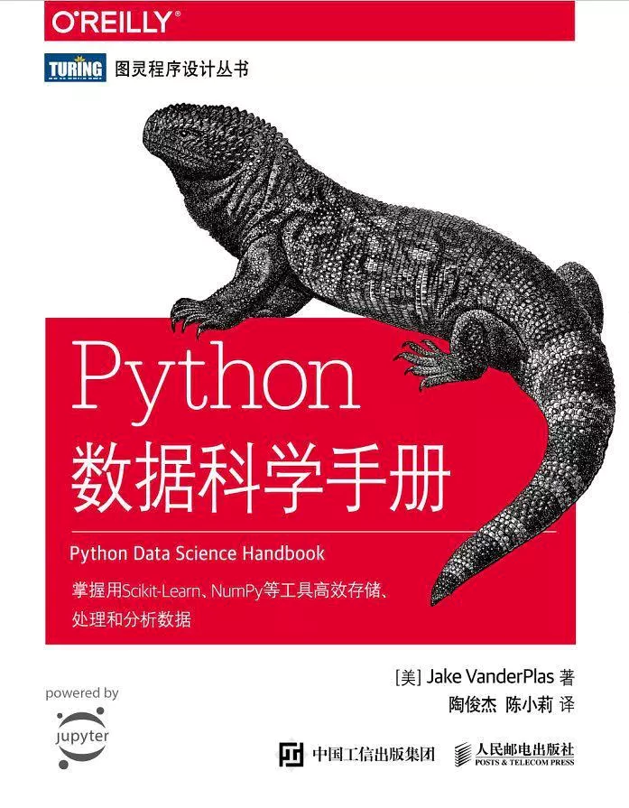

# 《Python数据科学手册》学习笔记

## 链接：

[第一章  IPython使用](<https://nbviewer.jupyter.org/github/KuiyuanZhang/Python-Data-Science-Handbook-Notebooks/blob/master/Code/1%20-%20IPython.ipynb>)

[第二章  NumPy入门](https://nbviewer.jupyter.org/github/)

[第三章  Pandas数据处理](https://nbviewer.jupyter.org/github/)

[第四章  Matplotlib数据可视化](https://nbviewer.jupyter.org/github/)

[第五章  机器学习](https://nbviewer.jupyter.org/github/)